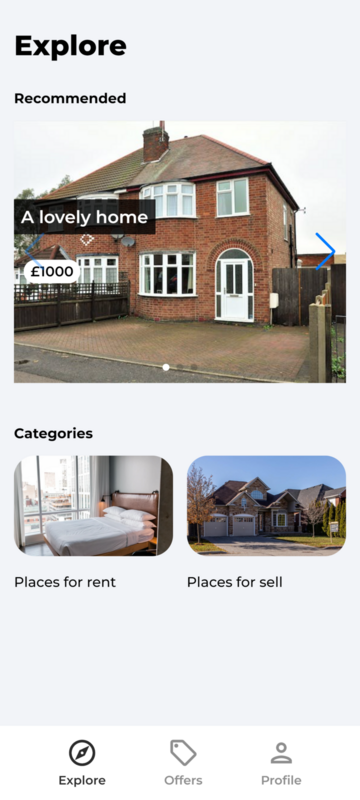
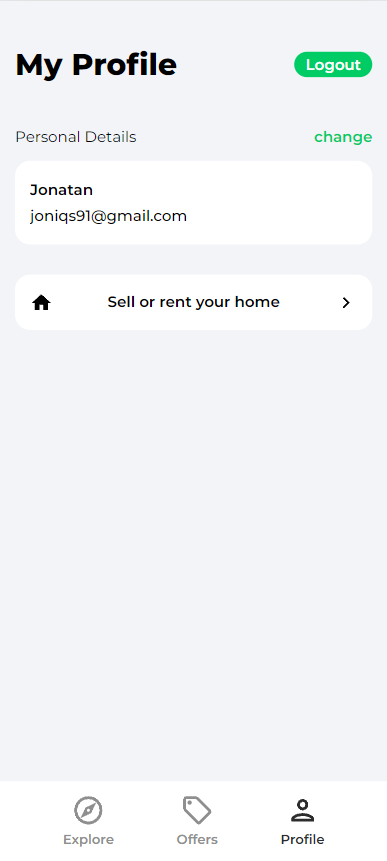
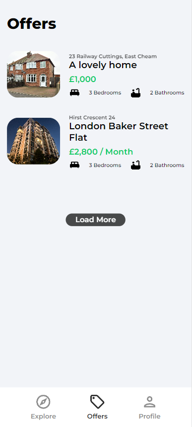
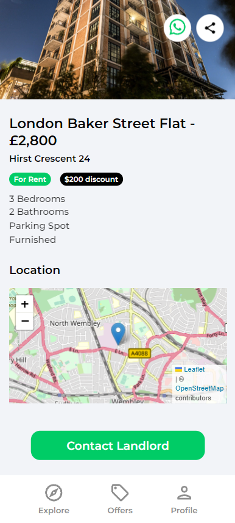

# Housemarketplace App

# Demo



**Starting Page**



**Profile Page**



**Listings Page**



**Details Page**

## Installation and Configuration

Make sure you have nodejs installed on your computer. After that clone this repository to your computer.

    git clone git@github.com:Joniqs/housemarketplaceapp.git

Move to your repository

    cd housemarketplaceapp

Make sure you have node modules installed in the same folder before running this program:

    npm install

You need to set your googleAuth, get geolocation API key and set your firebase in order to install and use this app. The listings use Google geocoding to get the coords from the address field. You need to add your Google Geocode API key OR in the CreateListing.jsx file you can set geolocationEnabled to "false" and it will add a lat/lng field to the form.

1. Create a Firebase project:

- Go to the Firebase Console and create a new project or select an existing project.
- Make sure you have set up your Firebase project and configured your app to use Firebase Hosting and the Realtime Database or Firestore.

2. Enable Google Authentication:

- In the Firebase Console, navigate to the Authentication section.
- Select the "Sign-in method" tab.
- Find the "Google" provider and click on the toggle to enable it.
- Configure any additional settings as needed.

3. Create a Firebase configuration file:

- In your React.js app, create a file named firebaseConfig.js or similar.
- In the Firebase Console, go to the project settings.
- Under the "General" tab, scroll down to find the Firebase SDK snippet.
- Copy the config object containing your Firebase project's credentials (apiKey, authDomain, etc.).
- Paste the config object into your firebaseConfig.js file.
- Export the config object as a module.

4. Install Firebase and required dependencies:

- In your React.js project, install the Firebase SDK and related dependencies:

```bash
    npm install firebase
```

5. Create your collection 'listings'

6. Add fields to your 'listings' collection:

- bathrooms: string
- bedrooms: string
- discountedPrice: string
- furnished: boolean
- geolocation: map
  - lat
  - lng
- imgUrls: array
- latitude: number
- location: string
- longitude: number
- name: string
- offer: boolean
- parking: boolean
- regularPrice: string
- timestamp: timestamp
- type: string
- userRef: string

7. Create 'users' collection

8. Add fields to 'users' collection

- email: string
- name: string
- timestamp: timestamp

9. Add Firestore Rules

```bash
// FIRESTORE RULES

rules_version = '2';
service cloud.firestore {
  match /databases/{database}/documents {
    // Listings
    match /listings/{listing} {
    	allow read;
      allow create: if request.auth != null && request.resource.data.imgUrls.size() < 7;
    	allow delete: if resource.data.userRef == request.auth.uid;
      allow update: if resource.data.userRef == request.auth.uid;
    }

    // Users
    match /users/{user} {
    	allow read;
    	allow create;
    	allow update: if request.auth.uid == user
    }
  }
}


// STORAGE RULES

rules_version = '2';
service firebase.storage {
  match /b/{bucket}/o {
    match /{allPaths=**} {
      allow read;
      allow write: if
      request.auth != null &&
      request.resource.size < 2 * 1024 * 1024 && //2MB
      request.resource.contentType.matches('image/.*')
    }
  }
}
```

10. Create .env file so it works locally:

```bash
    REACT_APP_GEOCODE_API_KEY = "your_geocode_api_key"
    REACT_APP_FIREBASE_AUTH_DOMAIN = 'your_firebase_auth_domain'
    REACT_APP_FIREBASE_PROJECT_ID = 'your_firebase_project_id'
    REACT_APP_FIREBASE_STORAGE_BUCKET = 'your_firebase_storage_bucket'
    REACT_APP_FIREBASE_API_KEY = "your_firebase_api_key"
    REACT_APP_APP_ID = "your_app_id"
    REACT_APP_MESSAGING_SENDER_ID = "your_messaging_sender_id"
```

## Usage/Examples

You can add your own listings for rent/sale properties, upload pictures.

## Credits

Jonatan Kwiatkowski

# License

Please refer to the LICENSE in the repo.
